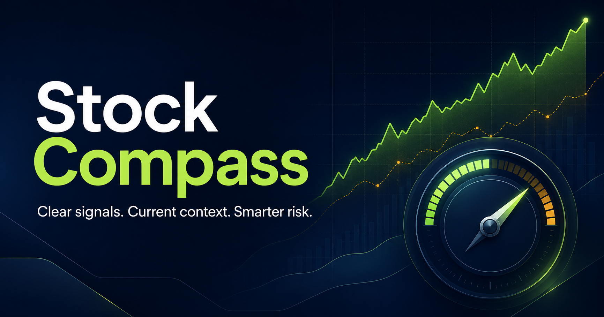

# Stock Compass

An explainable stock research and decision-support dashboard by **Tan Yann Bin**.

Stock Compass combines market information, technical indicators, company fundamentals, news and portfolio tools in one application. It explains the rules behind each setup and helps users plan risk. It does not execute broker orders.



**Status: personal beta and portfolio project.** A setup score is not a probability of success. Public feeds can be delayed or unavailable, and historical results are hypothetical.

## What is included

| Area | Features |
| --- | --- |
| Market dashboard | 20 starter symbols, custom U.S. ticker entry, searchable board and browser-saved watchlist |
| Quotes | Regular, pre-market and after-hours observations when supplied; timestamps, source and stale-data status |
| Charts and details | 1D, 5D, 1M, 3M, 6M and 1Y line charts; open, daily range, previous close, volume, average volume and 52-week range |
| Decision support | Short-term trend, RSI and support rules; separate potential-buyer and holder explanations |
| Fundamentals | Available valuation, growth, debt, cash flow and earnings fields, with missing data identified |
| Holdings | Shares, average purchase price, stop and unrealised profit/loss |
| Transaction journal | Buys, partial sales, fees, dividends, average cost and realised profit/loss |
| Exit planning | Stop, 1R and 2R targets, trailing-stop reference and estimated USD/MYR position sizing |
| Historical research | Daily-bar strategy backtest, later-period results, trade count, win rate, average return, profit factor and closed-trade drawdown |
| News | Dated headlines, duplicate filtering, direct/indirect relevance and keyword-based impact explanations |
| Alerts | One-time price threshold alerts and optional browser notifications while the page is open |
| Feed health | Real sample probes, bounded requests, caching, fallbacks and stale-signal blocking |

Overnight quotes are **not implemented**. Bid/ask requires a usable Alpaca quote and appropriate account entitlement. Adding API keys does not guarantee the same coverage or prices as a broker.

## Run on your computer

Install [Node.js](https://nodejs.org/) **24 LTS** (minimum supported version: 22.18) and [Git](https://git-scm.com/). Open a terminal or Windows PowerShell:

```bash
git clone https://github.com/yannbintan/Stock-Compass.git
cd Stock-Compass
npm ci
npm run dev
```

Open **http://localhost:3000**. Keep the terminal running; press `Ctrl+C` to stop.

No account, database or paid API key is needed to try the public fallbacks. Internet access is required for current market data. Each person can clone the project and run their own local copy.

The repository contains a committed lockfile, so use `npm ci` for reproducible installs. The npm commands work without Bash-specific environment assignments or shell scripts.

### Preview a production build

```bash
npm run build
npm start
```

Open **http://localhost:3000** again. Stop the development server first so the port is free.

## Optional provider keys

Copy `.env.example` to `.env.local` in the project root, then fill in your own values. You can copy it with your file manager, or in PowerShell:

```powershell
Copy-Item .env.example .env.local
```

On macOS/Linux:

```bash
cp .env.example .env.local
```

| Variable | Purpose |
| --- | --- |
| `ALPACA_API_KEY` | Optional server-side Alpaca API key |
| `ALPACA_API_SECRET` | Corresponding Alpaca secret |
| `ALPACA_DATA_FEED` | Defaults to `iex`; change only to a feed supported by the code and your account |
| `FINNHUB_API_KEY` | Optional fundamentals and earnings source |

Restart the server after changing these values. Local Node development/preview loads `.env.local`; `.dev.vars.example` is also included for developers using Wrangler or the Worker emulator directly. `.dev.vars` and local `.env` files are ignored by Git. Never put credentials in browser code or variables prefixed with `VITE_` or `NEXT_PUBLIC_`.

Without keys, the app attempts public Yahoo/Stooq price feeds, Yahoo financial statements, and Google News/Yahoo RSS. Missing, stale or unsupported fields remain labelled. A failed public feed is not evidence that the market has no activity.

## Publish with your own Cloudflare account

The included configuration runs the dashboard and API together on Cloudflare Workers. It does not contain the original host's project identity or require its domain.

```bash
npx wrangler login
npm run deploy
```

Wrangler prints the deployed address. Use that actual address in your repository description once deployment succeeds. An independent public demo has not been provisioned by this source upload.

For provider secrets on the deployed Worker:

```bash
npx wrangler secret put ALPACA_API_KEY
npx wrangler secret put ALPACA_API_SECRET
npx wrangler secret put FINNHUB_API_KEY
```

Add only the secrets you use. Non-secret settings belong in `wrangler.jsonc`. Review your provider's display/redistribution permissions and hosting limits before inviting public users. There is no global per-user rate limiter or account system in this beta. GitHub Pages cannot run the server-side API routes.

The project retains its pinned [Vinext](https://github.com/cloudflare/vinext) and Cloudflare Vite integration. See [Cloudflare Vite documentation](https://developers.cloudflare.com/workers/vite-plugin/) for hosting configuration. `npm run check:worker` prepares a deployment package without publishing it.

## Verification

```bash
npm run typecheck
npm test
npm run check:worker
```

`npm test` builds the production application and runs the Node.js tests. Coverage includes transaction accounting, exit targets, one-time alerts, holiday/session freshness, provider failure handling, news fallbacks, financial statement parsing, HTML rendering and invalid symbols. Provider responses in regression tests are controlled fixtures; passing tests do not guarantee that external feeds are currently available.

The included [GitHub Actions workflow](.github/workflows/ci.yml) runs these checks after pushes and pull requests. It does not publish the website or require provider credentials.

Other commands:

| Command | Purpose |
| --- | --- |
| `npm run dev` | Local development with hot reload |
| `npm run build` | Build the client and Worker |
| `npm start` | Preview the built application locally |
| `npm run test:unit` | Run tests against an existing build |
| `npm run lint` | Inspect code style and framework lint findings |
| `npm run deploy` | Build and deploy to your authenticated Cloudflare account |

## Project structure

| Path | Contents |
| --- | --- |
| `app/page.tsx` | Dashboard, signals, forms and browser state |
| `app/data.ts` | Starter symbols and built-in reference snapshots |
| `app/lib/` | Portfolio accounting, alerts and quote freshness |
| `app/api/market/` | Daily and intraday data providers |
| `app/api/fundamentals/` | Company metrics and dated statements |
| `app/api/backtest/` | Historical strategy simulation |
| `app/api/news/` | News retrieval and classification |
| `app/api/health/` | Sample service-health probes |
| `app/globals.css` | Responsive dashboard styles |
| `public/` | Project banner and static icons |
| `worker/` | Cloudflare runtime entry |
| `tests/` | Calculation, rendering and feed regression tests |
| `docs/` | Methodology and data-source limitations |
| `wrangler.jsonc` | Independent Worker deployment settings |

## Understand the results

- **74/100 is a rule-based score, not a 74% chance of profit.** The live setup rules and historical entry strategy are related but not identical.
- Long-term scores still start from predefined assessments for starter symbols and adjust using available metrics. They are not a fully independent valuation model.
- The backtest's later 30% period is a chronological reporting subset, not proof of out-of-sample predictive accuracy. Drawdown is measured at trade closures. Daily-bar execution, overnight gaps, dividends and other modelling limits are described in [Methodology](docs/METHODOLOGY.md).
- Alerts require the dashboard to remain open and usable quote data to be loaded. They are price alerts, not a background email/push or signal-alert service.
- The USD/MYR conversion uses the rate entered by the user. It is not a live FX feed.
- These tests and safeguards support research, not automatic trading. Confirm current prices and intended orders in your broker.

## Local data and privacy

Holdings, journals, watchlists and alert settings remain in `localStorage` in that browser and origin. They are not uploaded as a shared portfolio. Clearing browser data can delete them, and opening a different domain, port or browser does not transfer them. There are no accounts, cloud synchronisation or built-in backup/import controls in this release.

Stock-data requests send requested tickers and normal connection metadata to the application host and relevant providers. Do not publish API keys or personal transaction exports in this repository. See [Data sources](docs/DATA_SOURCES.md).

## Source and author

This is a portable export of the **original Stock Compass version 9** source, recovered from commit `6c1024da512a81100d05d5c8770fc50126d9aae4`. It replaces the earlier README describing a proposed standalone rewrite. The dashboard and data routes come from that original project; the export adapts build/deployment configuration and documentation for GitHub and localhost.

**Tan Yann Bin** — System Analytics / Data Analytics, Sunway University.

This project demonstrates TypeScript/React development, API integration, financial-data processing, explainable rules and automated regression checks. No project licence has been selected; dependency licences remain with their respective owners.
